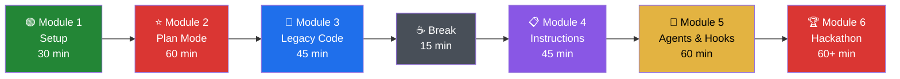

# 🤖 GitHub Copilot Hackathon Workshop

> **4+ hours** of hands-on content for **~70 C#/.NET developers** to hack GitHub Copilot capabilities.

## 🗺️ Workshop Journey



## 🚀 Quick Start

```bash
# Clone the repo
git clone https://github.com/udayansarma/Copilot-Hack-Workshop-v1.git
cd Copilot-Hack-Workshop-v1/workshop

# Install dependencies
npm install

# Start both frontend and backend
npm run dev
```

The workshop portal opens at **http://localhost:5173**. The API runs on port **3001**.

## 📋 Workshop Modules

| # | Module | Duration | Focus | Exercise |
|---|--------|----------|-------|----------|
| 1 | Welcome & Setup | 30 min | Environment check, Copilot basics | Verify tools, first Copilot interaction |
| 2 | **Build a Web App from Scratch** ⭐ | 60 min | Plan Mode — scaffold a full-stack C# app | [Exercise →](workshop/exercises/module-2-plan-mode/) |
| 3 | Modernizing Legacy C# | 45 min | Async, DI, refactoring with Copilot Chat | [Exercise →](workshop/exercises/module-3-legacy-code/) |
| 4 | Custom Instructions | 45 min | `.github/copilot-instructions.md`, team standards | [Exercise →](workshop/exercises/module-4-instructions/) |
| 5 | Agents, Skills, MCP & Hooks | 60 min | Build agents, MCP servers, pre-commit hooks | [Exercise →](workshop/exercises/module-5-agents/) |
| 6 | Hackathon Challenge | 60+ min | Team competition with live leaderboard | Portal-guided |

## 🎯 What You'll Build

```mermaid
graph TD
    subgraph "Module 2 — Plan Mode"
        A1[Describe App] --> A2[Review Plan] --> A3[Approve & Build] --> A4[Full-Stack App]
    end
    
    subgraph "Module 3 — Legacy Code"
        B1[Legacy C# File] --> B2[Identify Anti-Patterns] --> B3[Modern Repository]
    end
    
    subgraph "Module 4 — Instructions"
        C1[Write Standards] --> C2[Test With/Without] --> C3[Measurable Difference]
    end
    
    subgraph "Module 5 — Agents & Hooks"
        D1[Create Agent] --> D2[Code Review Bot]
        D3[Create Hook] --> D4[Auto-Format on Commit]
    end
    
    style A4 fill:#238636,color:#fff
    style B3 fill:#238636,color:#fff
    style C3 fill:#238636,color:#fff
    style D2 fill:#238636,color:#fff
    style D4 fill:#238636,color:#fff
```



## 📁 Repository Structure

```
├── workshop/
│   ├── frontend/           # React + Vite + TailwindCSS workshop portal
│   ├── backend/            # Express + SQLite progress tracking API
│   ├── exercises/          # Starter code & instructions per module
│   │   ├── module-2-plan-mode/          # Plan Mode step-by-step guide
│   │   ├── module-3-legacy-code/        # Legacy C# with 8 anti-patterns
│   │   ├── module-4-instructions/       # copilot-instructions.md template
│   │   ├── module-5-agents/             # Code review agent + hooks
│   │   └── awesome-copilot-guide/       # Integration guide for awesome-copilot
│   ├── package.json        # Root workspace (npm install here)
│   └── README.md           # Facilitator guide with agenda & tips
├── .github/
│   └── copilot-instructions.md  # Meta-example for the workshop repo
└── README.md               # ← You are here
```

## 📋 Prerequisites

| Tool | Version | Check Command | Why |
|------|---------|--------------|-----|
| **Node.js** | 18+ | `node --version` | Workshop portal |
| **.NET SDK** | 8+ | `dotnet --version` | C# exercises |
| **VS Code** | Latest | `code --version` | IDE with Copilot |
| **GitHub Copilot** | Extension | Check Extensions panel | AI assistant |
| **Git** | 2.30+ | `git --version` | Clone & commit |

## 🔗 Resources

- [awesome-copilot](https://github.com/github/awesome-copilot) — Community agents, instructions, skills, plugins, hooks & workflows
- [GitHub Copilot Docs](https://docs.github.com/copilot)
- [Awesome Copilot Integration Guide](workshop/exercises/awesome-copilot-guide/) — Detailed participant guide for installing C#/.NET resources

## 👥 Facilitators

See [`workshop/README.md`](workshop/README.md) for the full facilitator guide with timing, tips, and preparation checklist.

## 📄 License

This workshop content is provided for educational use.
