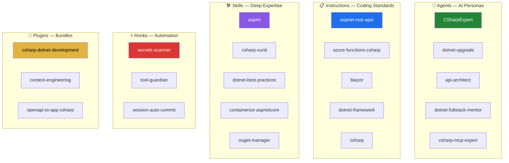

# 🤖 Awesome Copilot Integration Guide

> **Hands-on guide for incorporating [github/awesome-copilot](https://github.com/github/awesome-copilot) capabilities into your C#/.NET projects.**

The `awesome-copilot` repository is a community collection of **agents, instructions, skills, plugins, hooks, and workflows** that supercharge GitHub Copilot. This guide walks you through installing and using each capability area — with a focus on C#/.NET development.

## 📐 Capability Map



---

## Table of Contents

1. [Agents — Specialized AI Assistants](#1-agents--specialized-ai-assistants)
2. [Instructions — Team Coding Standards](#2-instructions--team-coding-standards)
3. [Skills — Self-Contained Task Bundles](#3-skills--self-contained-task-bundles)
4. [Plugins — Curated Agent+Skill Bundles](#4-plugins--curated-agentskill-bundles)
5. [Hooks — Automated Session Actions](#5-hooks--automated-session-actions)
6. [Workflows — AI-Powered GitHub Actions](#6-workflows--ai-powered-github-actions)
7. [Putting It All Together](#7-putting-it-all-together)

---

## 1. Agents — Specialized AI Assistants

Agents are `.agent.md` files that specialize Copilot for specific tasks. They define a persona, expertise, and behavioral rules.

### How Agents Work
- Each agent is a single markdown file with YAML frontmatter
- Place in your repo's `.github/agents/` directory (or install via VS Code)
- Agents can connect to MCP servers for external tool access

### C#/.NET Agents to Install

#### C# Expert
The foundational agent for all C#/.NET work. Covers async patterns, SOLID principles, testing, and performance.

```bash
# Download and install
curl -o .github/agents/CSharpExpert.agent.md \
  https://raw.githubusercontent.com/github/awesome-copilot/main/agents/CSharpExpert.agent.md
```

**What it does:**
- Enforces modern C# conventions (records, file-scoped namespaces, primary constructors)
- Guides async/await best practices with CancellationToken
- Provides testing guidance (xUnit, NUnit, MSTest) with AAA pattern
- Covers security, performance, and cloud-native patterns

#### .NET Upgrade Agent
Performs janitorial tasks on C#/.NET code including cleanup, modernization, and tech debt remediation.

```bash
curl -o .github/agents/dotnet-upgrade.agent.md \
  https://raw.githubusercontent.com/github/awesome-copilot/main/agents/dotnet-upgrade.agent.md
```

**Use when:** Upgrading .NET Framework → .NET 8+, removing deprecated APIs, modernizing project files.

#### .NET Self-Learning Architect
Senior .NET architect for complex delivery — designs systems, manages sub-agents, and captures lessons learned.

```bash
curl -o .github/agents/dotnet-self-learning-architect.agent.md \
  https://raw.githubusercontent.com/github/awesome-copilot/main/agents/dotnet-self-learning-architect.agent.md
```

**Use when:** Designing large-scale .NET systems, multi-service architectures, or complex delivery projects.

#### API Architect
Mentors engineers on API design — provides guidance, support, and working code.

```bash
curl -o .github/agents/api-architect.agent.md \
  https://raw.githubusercontent.com/github/awesome-copilot/main/agents/api-architect.agent.md
```

**Use when:** Designing REST APIs, reviewing API contracts, or establishing API standards.

#### C# .NET Janitor *(New)*
Performs cleanup, modernization, and tech debt remediation on C#/.NET codebases.

```bash
curl -o .github/agents/csharp-dotnet-janitor.agent.md \
  https://raw.githubusercontent.com/github/awesome-copilot/main/agents/csharp-dotnet-janitor.agent.md
```

**Use when:** Cleaning up code smells, removing dead code, modernizing syntax.

#### C# MCP Expert *(New)*
Specializes in building and using MCP (Model Context Protocol) servers in C#.

```bash
curl -o .github/agents/csharp-mcp-expert.agent.md \
  https://raw.githubusercontent.com/github/awesome-copilot/main/agents/csharp-mcp-expert.agent.md
```

**Use when:** Building custom MCP servers in C#, connecting agents to external tools.

#### .NET Fullstack Mentor *(New)*
A fullstack .NET mentor covering frontend, backend, and cloud deployment.

```bash
curl -o .github/agents/dotnet-fullstack-mentor.agent.md \
  https://raw.githubusercontent.com/github/awesome-copilot/main/agents/dotnet-fullstack-mentor.agent.md
```

**Use when:** Building end-to-end .NET applications, learning fullstack patterns.

#### Expert .NET Software Engineer *(New)*
Senior-level .NET engineering guidance across the full software lifecycle.

```bash
curl -o .github/agents/expert-dotnet-software-engineer.agent.md \
  https://raw.githubusercontent.com/github/awesome-copilot/main/agents/expert-dotnet-software-engineer.agent.md
```

**Use when:** Complex engineering decisions, architecture reviews, production-readiness.

### Exercise: Install & Test an Agent
1. Create `.github/agents/` in your project
2. Download the C# Expert agent (command above)
3. Open VS Code Chat and invoke the agent: `@csharp-expert Review this controller for anti-patterns`
4. Try with different code samples and observe the specialized responses

---

## 2. Instructions — Team Coding Standards

Instructions are `.instructions.md` files that automatically guide Copilot to follow your team's coding standards.

### How Instructions Work
- **Project-level**: `.github/copilot-instructions.md` — applies to entire repository
- **Folder-level**: `.instructions.md` in any directory — applies to that directory and subdirectories
- **Task-specific**: `.github/instructions/*.instructions.md` — applies based on `applyTo` glob patterns
- Instructions **stack** — more specific files override general ones

### C#/.NET Instructions to Install

#### .NET Framework Development
```bash
curl -o .github/instructions/dotnet-framework.instructions.md \
  https://raw.githubusercontent.com/github/awesome-copilot/main/instructions/dotnet-framework.instructions.md
```
Covers: Project structure, C# language version, NuGet management, and best practices.

#### ASP.NET REST API Development
```bash
curl -o .github/instructions/aspnet-rest-apis.instructions.md \
  https://raw.githubusercontent.com/github/awesome-copilot/main/instructions/aspnet-rest-apis.instructions.md
```
Covers: REST conventions, controller patterns, OpenAPI docs, error handling.

#### Azure Functions C# Development
```bash
curl -o .github/instructions/azure-functions-csharp.instructions.md \
  https://raw.githubusercontent.com/github/awesome-copilot/main/instructions/azure-functions-csharp.instructions.md
```
Covers: Isolated worker model, bindings, dependency injection in Functions.

#### Azure Durable Functions C#
```bash
curl -o .github/instructions/azure-durable-functions-csharp.instructions.md \
  https://raw.githubusercontent.com/github/awesome-copilot/main/instructions/azure-durable-functions-csharp.instructions.md
```
Covers: Orchestrator functions, activity functions, fan-out/fan-in patterns.

#### .NET Framework Upgrade Specialist
```bash
curl -o .github/instructions/dotnet-upgrade.instructions.md \
  https://raw.githubusercontent.com/github/awesome-copilot/main/instructions/dotnet-upgrade.instructions.md
```
Covers: Progressive migration from .NET Framework to modern .NET.

#### General C# *(New)*
```bash
curl -o .github/instructions/csharp.instructions.md \
  https://raw.githubusercontent.com/github/awesome-copilot/main/instructions/csharp.instructions.md
```
Covers: Comprehensive C# coding guidelines and conventions.

#### Blazor *(New)*
```bash
curl -o .github/instructions/blazor.instructions.md \
  https://raw.githubusercontent.com/github/awesome-copilot/main/instructions/blazor.instructions.md
```
Covers: Blazor component development, state management, interop.

#### C# MCP Server Development *(New)*
```bash
curl -o .github/instructions/csharp-mcp-server.instructions.md \
  https://raw.githubusercontent.com/github/awesome-copilot/main/instructions/csharp-mcp-server.instructions.md
```
Covers: Building MCP servers in C# for Copilot tool integration.

#### Razor Pages *(New)*
```bash
curl -o .github/instructions/csharp-razorpages.instructions.md \
  https://raw.githubusercontent.com/github/awesome-copilot/main/instructions/csharp-razorpages.instructions.md
```
Covers: Razor Pages development patterns and best practices.

#### .NET Architecture Best Practices *(New)*
```bash
curl -o .github/instructions/dotnet-architecture-good-practices.instructions.md \
  https://raw.githubusercontent.com/github/awesome-copilot/main/instructions/dotnet-architecture-good-practices.instructions.md
```
Covers: Clean architecture, SOLID principles, design patterns for .NET.

#### .NET WPF *(New)*
```bash
curl -o .github/instructions/dotnet-wpf.instructions.md \
  https://raw.githubusercontent.com/github/awesome-copilot/main/instructions/dotnet-wpf.instructions.md
```
Covers: WPF desktop application development with MVVM pattern.

#### .NET MAUI *(New)*
```bash
curl -o .github/instructions/dotnet-maui.instructions.md \
  https://raw.githubusercontent.com/github/awesome-copilot/main/instructions/dotnet-maui.instructions.md
```
Covers: .NET MAUI cross-platform mobile and desktop development.

#### Playwright .NET *(New)*
```bash
curl -o .github/instructions/playwright-dotnet.instructions.md \
  https://raw.githubusercontent.com/github/awesome-copilot/main/instructions/playwright-dotnet.instructions.md
```
Covers: End-to-end testing with Playwright for .NET applications.

#### Copilot SDK for C# *(New)*
```bash
curl -o .github/instructions/copilot-sdk-csharp.instructions.md \
  https://raw.githubusercontent.com/github/awesome-copilot/main/instructions/copilot-sdk-csharp.instructions.md
```
Covers: Building applications using the GitHub Copilot SDK in C#.

### Exercise: Install & Compare
1. Pick **two** instruction files from the list above and download them
2. Open a C# file and ask Copilot to generate a new service class **without** instructions installed
3. Save the output somewhere
4. Now install the instructions and ask the same question again
5. **Compare** the two outputs — notice how instructions change Copilot's behavior

---

## 3. Skills — Self-Contained Task Bundles

Skills are folders with a `SKILL.md` file plus bundled assets (scripts, templates, reference data). They provide deep expertise for specialized tasks.

### How Skills Work
- Each skill is a folder with a `SKILL.md` instruction file
- Skills can include helper scripts, code templates, and reference data
- Install via GitHub CLI: `gh skills install github/awesome-copilot <skill-name>`
- Skills are loaded on-demand when relevant to a task

### C#/.NET Skills to Install

#### .NET Aspire
```bash
gh skills install github/awesome-copilot aspire
```
Covers: Aspire CLI, AppHost orchestration, service discovery, integrations, dashboard, deployment. Includes reference docs for architecture, CLI, integrations catalog, and troubleshooting.

**Bundled assets:** 9 reference files covering architecture, CLI, dashboard, deployment, integrations, MCP, polyglot APIs, testing, and troubleshooting.

#### ASP.NET Minimal API + OpenAPI
```bash
gh skills install github/awesome-copilot aspnet-minimal-api-openapi
```
Covers: Creating Minimal API endpoints with proper OpenAPI documentation.

#### App Insights Instrumentation
```bash
gh skills install github/awesome-copilot appinsights-instrumentation
```
Covers: Instrumenting web apps to send telemetry to Azure Application Insights. Includes examples for ASP.NET Core, Node.js, and Python.

**Bundled assets:** Example code, reference docs for ASP.NET Core / Node.js / Python, PowerShell helper script.

#### Architecture Blueprint Generator
```bash
gh skills install github/awesome-copilot architecture-blueprint-generator
```
Covers: Analyze codebases to create detailed architectural documentation. Detects tech stacks, generates diagrams, documents patterns.

#### AI-Ready Repo Setup
```bash
gh skills install github/awesome-copilot ai-ready
```
Covers: Analyze your repo and generate AGENTS.md, copilot-instructions.md, CI workflows, and issue templates customized to your stack.

#### C# xUnit Testing *(New)*
```bash
gh skills install github/awesome-copilot csharp-xunit
```
Covers: Writing xUnit tests with AAA pattern, fixtures, theory data, and mocking.

#### C# NUnit Testing *(New)*
```bash
gh skills install github/awesome-copilot csharp-nunit
```
Covers: NUnit test patterns, assertions, and test lifecycle.

#### C# MSTest Testing *(New)*
```bash
gh skills install github/awesome-copilot csharp-mstest
```
Covers: MSTest framework patterns and Visual Studio integration.

#### C# Async Patterns *(New)*
```bash
gh skills install github/awesome-copilot csharp-async
```
Covers: Advanced async/await patterns, cancellation, parallel processing, channels.

#### .NET Best Practices *(New)*
```bash
gh skills install github/awesome-copilot dotnet-best-practices
```
Covers: Comprehensive .NET development best practices across all layers.

#### .NET Design Pattern Review *(New)*
```bash
gh skills install github/awesome-copilot dotnet-design-pattern-review
```
Covers: Review code against SOLID, GoF, and enterprise .NET patterns.

#### .NET MCP Server Builder *(New)*
```bash
gh skills install github/awesome-copilot dotnet-mcp-builder
```
Covers: Building MCP servers in .NET to provide tools to Copilot agents.

#### Containerize ASP.NET Core *(New)*
```bash
gh skills install github/awesome-copilot containerize-aspnetcore
```
Covers: Dockerizing ASP.NET Core apps with multi-stage builds and best practices.

#### Containerize ASP.NET Framework *(New)*
```bash
gh skills install github/awesome-copilot containerize-aspnet-framework
```
Covers: Containerizing legacy ASP.NET Framework apps with Windows containers.

#### NuGet Package Manager *(New)*
```bash
gh skills install github/awesome-copilot nuget-manager
```
Covers: NuGet package management, version conflicts, vulnerability scanning.

#### .NET Upgrade *(New)*
```bash
gh skills install github/awesome-copilot dotnet-upgrade
```
Covers: Upgrading .NET Framework projects to modern .NET with migration strategies.

#### Fluent UI Blazor *(New)*
```bash
gh skills install github/awesome-copilot fluentui-blazor
```
Covers: Using Fluent UI components in Blazor applications.

#### C# XML Documentation *(New)*
```bash
gh skills install github/awesome-copilot csharp-docs
```
Covers: Generating XML documentation comments for C# code.

### Exercise: Install Aspire Skill
1. Run: `gh skills install github/awesome-copilot aspire`
2. Open your project and ask Copilot: "Set up an Aspire AppHost for my web API and database"
3. Notice how Copilot has deep knowledge of Aspire patterns and generates accurate orchestration code
4. Explore the bundled reference files that the skill installed

---

## 4. Plugins — Curated Agent+Skill Bundles

Plugins bundle related agents and skills into themed packages. They're the easiest way to adopt a comprehensive toolkit.

### How Plugins Work
- Plugins are curated bundles of agents and skills
- **Awesome Copilot is a default plugin marketplace** — no setup required
- Install via Copilot CLI: `copilot plugin install <name>@awesome-copilot`
- Or browse in VS Code: Extensions view → `@agentPlugins`

### C#/.NET Plugins to Install

#### C# and .NET Development (9 items)
```bash
copilot plugin install csharp-dotnet-development@awesome-copilot
```
**Includes:** Essential prompts, instructions, and chat modes for C# and .NET development including testing, documentation, and best practices.

#### OpenAPI to C#/.NET Application (2 items)
```bash
copilot plugin install openapi-to-application-csharp-dotnet@awesome-copilot
```
**Includes:** Generate production-ready .NET applications from OpenAPI specifications. ASP.NET Core project scaffolding, controller generation, Entity Framework integration.

#### Copilot SDK (1 item)
```bash
copilot plugin install copilot-sdk@awesome-copilot
```
**Includes:** Build applications with the GitHub Copilot SDK in C#, Go, Node.js, and Python.

#### Context Engineering (4 items)
```bash
copilot plugin install context-engineering@awesome-copilot
```
**Includes:** Tools for maximizing Copilot effectiveness through better context management. Guidelines for structuring code, planning multi-file changes, and context-aware development.

#### Project Planning (9 items)
```bash
copilot plugin install project-planning@awesome-copilot
```
**Includes:** Tools for software project planning, feature breakdown, epic management, implementation planning, and task organization.

#### Oracle to PostgreSQL Migration (8 items)
```bash
copilot plugin install oracle-to-postgres-migration-expert@awesome-copilot
```
**Includes:** Expert agent for Oracle-to-PostgreSQL migrations in .NET solutions. Code edits, SQL migration, stored procedures, integration testing.

### Exercise: Install the C# Plugin
1. Run: `copilot plugin install csharp-dotnet-development@awesome-copilot`
2. Browse what got installed — agents and skills for C# development
3. Try asking Copilot to generate a new service with EF Core — notice the enhanced quality
4. Try: `copilot plugin install context-engineering@awesome-copilot` for better prompt results

---

## 5. Hooks — Automated Session Actions

Hooks are automated actions that trigger during Copilot coding agent sessions (session start/end, tool usage, prompts).

### How Hooks Work
- Each hook is a folder with a `hooks.json` config and helper scripts
- Place in your repo's `.github/hooks/` directory
- Available trigger events:
  - `sessionStart` / `sessionEnd`
  - `userPromptSubmitted`
  - `preToolUse` / `postToolUse`
  - `errorOccurred`
- Hooks run automatically during Copilot agent sessions

### Hooks to Install

#### Secrets Scanner
Scans files modified during a Copilot coding agent session for leaked secrets, credentials, and sensitive data.

```bash
# Copy from awesome-copilot
git clone --depth 1 https://github.com/github/awesome-copilot.git /tmp/awesome-copilot
cp -r /tmp/awesome-copilot/hooks/secrets-scanner .github/hooks/
```

**Trigger:** `sessionEnd` — scans all modified files when the agent finishes.

#### Tool Guardian
Blocks dangerous tool operations (destructive file ops, force pushes, DB drops) **before** the agent executes them.

```bash
cp -r /tmp/awesome-copilot/hooks/tool-guardian .github/hooks/
```

**Trigger:** `preToolUse` — intercepts and blocks dangerous operations.

#### Dependency License Checker
Scans newly added dependencies for license compliance (GPL, AGPL, etc.) at session end.

```bash
cp -r /tmp/awesome-copilot/hooks/dependency-license-checker .github/hooks/
```

**Trigger:** `sessionEnd` — ensures no problematic licenses are introduced.

#### Session Auto-Commit
Automatically commits and pushes changes when a Copilot coding agent session ends.

```bash
cp -r /tmp/awesome-copilot/hooks/session-auto-commit .github/hooks/
```

**Trigger:** `sessionEnd` — auto-commits with a descriptive message.

#### Governance Audit
Scans agent prompts for threat signals and logs governance events.

```bash
cp -r /tmp/awesome-copilot/hooks/governance-audit .github/hooks/
```

**Triggers:** `sessionStart`, `sessionEnd`, `userPromptSubmitted` — full audit trail.

#### Session Logger *(New)*
Logs all Copilot agent session activity for debugging and audit purposes.

```bash
cp -r /tmp/awesome-copilot/hooks/session-logger .github/hooks/
```

**Trigger:** Multiple events — comprehensive session activity logging.

### Exercise: Install the Secrets Scanner
1. Copy the secrets-scanner hook into `.github/hooks/`
2. Ensure the scan script is executable: `chmod +x .github/hooks/secrets-scanner/scan-secrets.sh`
3. Commit the hook to your repo
4. Start a Copilot agent session and make some changes
5. When the session ends, check if the scanner caught anything

---

## 6. Workflows — AI-Powered GitHub Actions

Agentic Workflows are AI-powered repository automations defined in markdown. They run coding agents inside GitHub Actions.

### How Workflows Work
- Each workflow is a `.md` file with YAML frontmatter + natural language instructions
- Install the CLI: `gh extension install github/gh-aw`
- Compile to GitHub Actions: `gh aw compile`
- Triggers: schedules, events, slash commands
- Monitor with: `gh aw status` and `gh aw logs`

### Workflows to Install

#### Daily Issues Report
Generates a daily summary of open issues and recent activity.

```bash
curl -o .github/workflows/daily-issues-report.md \
  https://raw.githubusercontent.com/github/awesome-copilot/main/workflows/daily-issues-report.md

# Compile to GitHub Actions
gh aw compile
```

**Trigger:** `schedule` — runs daily and creates a summary issue.

#### Relevance Check (Slash Command)
Evaluate whether an issue or PR is still relevant to the project.

```bash
curl -o .github/workflows/relevance-check.md \
  https://raw.githubusercontent.com/github/awesome-copilot/main/workflows/relevance-check.md
gh aw compile
```

**Trigger:** `/relevance-check` slash command in issues/PRs.

#### Weekly Comment Sync
Finds stale code comments or README snippets and opens a draft PR with updates.

```bash
curl -o .github/workflows/weekly-comment-sync.md \
  https://raw.githubusercontent.com/github/awesome-copilot/main/workflows/weekly-comment-sync.md
gh aw compile
```

**Trigger:** `schedule` (weekly) + `workflow_dispatch` for manual runs.

### Exercise: Install Daily Issues Report
1. Install the `gh aw` CLI extension: `gh extension install github/gh-aw`
2. Download the workflow markdown file (command above)
3. Compile: `gh aw compile`
4. Commit both the `.md` and `.lock.yml` files
5. The workflow runs on its schedule, or trigger manually: `gh aw run daily-issues-report`

---

## 7. Putting It All Together

Here's a recommended setup for a C#/.NET team to maximize Copilot's capabilities:

### Recommended Stack for C#/.NET Teams

```
your-repo/
├── .github/
│   ├── copilot-instructions.md          # Team-wide C# coding standards
│   ├── agents/
│   │   ├── CSharpExpert.agent.md        # C# development expert
│   │   ├── dotnet-upgrade.agent.md      # Legacy modernization
│   │   ├── api-architect.agent.md       # API design mentor
│   │   └── csharp-mcp-expert.agent.md   # MCP server building
│   ├── hooks/
│   │   ├── secrets-scanner/             # Scan for leaked secrets
│   │   ├── tool-guardian/               # Block dangerous operations
│   │   └── session-auto-commit/         # Auto-commit on session end
│   ├── instructions/
│   │   ├── aspnet-rest-apis.instructions.md
│   │   ├── azure-functions-csharp.instructions.md
│   │   ├── csharp.instructions.md
│   │   └── dotnet-architecture-good-practices.instructions.md
│   └── workflows/
│       ├── daily-issues-report.md
│       └── relevance-check.md
└── src/
    └── ... your code ...
```

### Quick Setup Script (All-in-One)

```bash
#!/bin/bash
# Setup script for awesome-copilot C#/.NET stack

REPO="https://raw.githubusercontent.com/github/awesome-copilot/main"

# Create directories
mkdir -p .github/agents .github/hooks .github/instructions .github/workflows

# Agents (core)
curl -so .github/agents/CSharpExpert.agent.md "$REPO/agents/CSharpExpert.agent.md"
curl -so .github/agents/dotnet-upgrade.agent.md "$REPO/agents/dotnet-upgrade.agent.md"
curl -so .github/agents/api-architect.agent.md "$REPO/agents/api-architect.agent.md"

# Agents (extended)
curl -so .github/agents/csharp-mcp-expert.agent.md "$REPO/agents/csharp-mcp-expert.agent.md"
curl -so .github/agents/dotnet-fullstack-mentor.agent.md "$REPO/agents/dotnet-fullstack-mentor.agent.md"

# Instructions
curl -so .github/instructions/csharp.instructions.md "$REPO/instructions/csharp.instructions.md"
curl -so .github/instructions/aspnet-rest-apis.instructions.md "$REPO/instructions/aspnet-rest-apis.instructions.md"
curl -so .github/instructions/dotnet-framework.instructions.md "$REPO/instructions/dotnet-framework.instructions.md"
curl -so .github/instructions/dotnet-architecture-good-practices.instructions.md "$REPO/instructions/dotnet-architecture-good-practices.instructions.md"

# Skills
gh skills install github/awesome-copilot aspire
gh skills install github/awesome-copilot aspnet-minimal-api-openapi
gh skills install github/awesome-copilot csharp-xunit
gh skills install github/awesome-copilot dotnet-best-practices

# Plugins
copilot plugin install csharp-dotnet-development@awesome-copilot
copilot plugin install context-engineering@awesome-copilot

echo "✅ Awesome Copilot C#/.NET stack installed!"
```

### Verification Checklist
- [ ] Agents respond when invoked in VS Code Chat
- [ ] Instructions change Copilot's code suggestions (test with/without)
- [ ] Skills provide deep expertise for specialized tasks
- [ ] Plugins are installed and accessible
- [ ] Hooks trigger during agent sessions
- [ ] Workflows compile and run on schedule

---

## 📚 Resources

- **Awesome Copilot Website**: [awesome-copilot.github.com](https://awesome-copilot.github.com)
- **Learning Hub**: [awesome-copilot.github.com/learning-hub](https://awesome-copilot.github.com/learning-hub)
- **Tools & MCP Servers**: [awesome-copilot.github.com/tools](https://awesome-copilot.github.com/tools)
- **GitHub Copilot Docs**: [docs.github.com/copilot](https://docs.github.com/copilot)
- **Agent Skills Specification**: [agentskills.io/specification](https://agentskills.io/specification)
