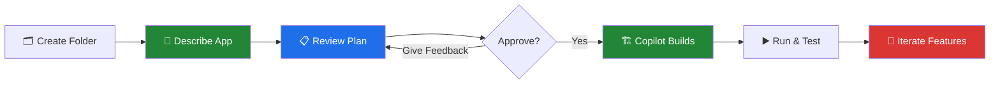
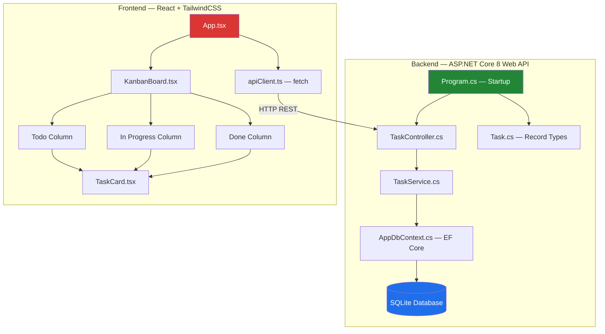
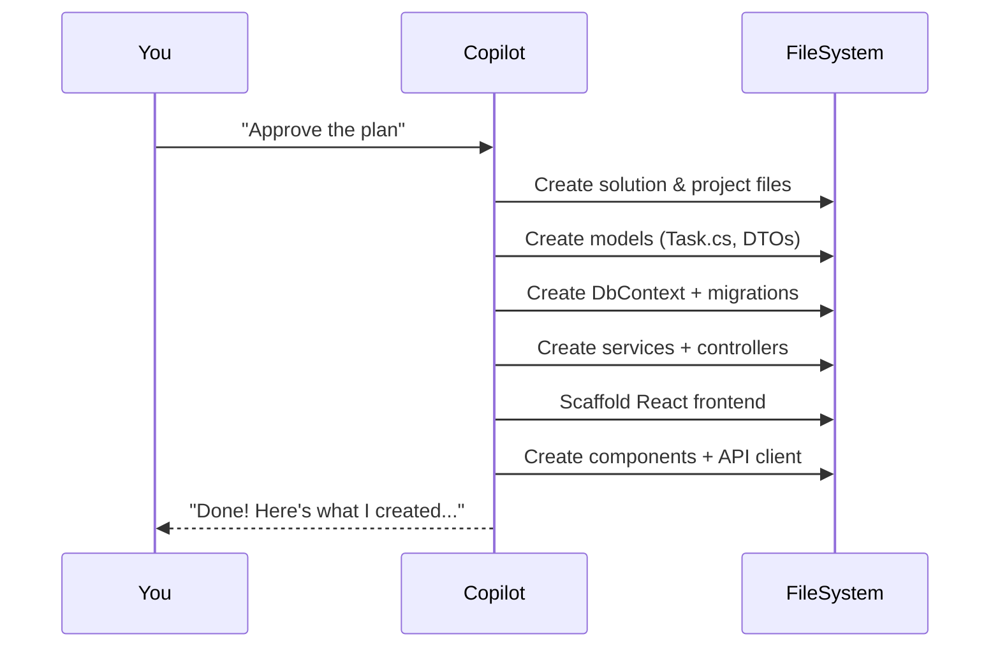

# Module 2: Build a Web App from Scratch — Plan Mode

> ⏱️ **Duration:** 60 minutes | 🎯 **Difficulty:** Intermediate | 👥 **Format:** Individual

## 🎯 Goal

Create a **complete web application** using **only Copilot prompts** — no manual coding! This module demonstrates Plan Mode, where Copilot designs an architecture, generates a file-by-file implementation plan, and builds everything after your approval.

## 📐 Exercise Overview



## 📐 What Copilot Will Create



## 📋 Prerequisites

Before starting, verify your environment:

```bash
# Check .NET 8 SDK
dotnet --version          # Should show 8.x.x

# Check Node.js
node --version            # Should show 18.x.x or higher

# Check VS Code + Copilot
code --version            # Should show VS Code version
```

> ⚠️ **All three must be installed.** If any are missing, ask a facilitator for help.

## 🚀 Step-by-Step Exercise

### Step 1: Create a New Project Folder (2 min)

```bash
mkdir my-copilot-app
cd my-copilot-app
code .                    # Open in VS Code
```

> 💡 Opening an **empty folder** in VS Code is important — it tells Copilot to scaffold from scratch.

### Step 2: Open Copilot Chat & Describe Your App (5 min)

Open the Copilot Chat panel (`Ctrl+Shift+I` or `Cmd+Shift+I`). Copilot will automatically enter **Plan Mode** for complex multi-file requests.

**Use this prompt** (copy/paste it):

```
Create an ASP.NET Core 8 Web API with a React + TailwindCSS frontend for managing 
a team task board. Requirements:
- SQLite database with Entity Framework Core
- CRUD operations for tasks (title, description, status, assignee)
- Task statuses: Todo, In Progress, Done
- RESTful API with proper error handling and validation
- Responsive UI with a Kanban-style board layout
- Dark mode support
- Use record types for DTOs
- Use file-scoped namespaces
```

### Step 3: Review the Plan (10 min)

Copilot will generate a structured plan showing:

| Plan Section | What to Look For |
|-------------|------------------|
| **File Structure** | Does the project layout make sense? Are files organized logically? |
| **Technology Choices** | Is it using EF Core, correct .NET version, React 18+? |
| **Implementation Steps** | Are the todos ordered correctly? (Models → DbContext → Services → Controllers → Frontend) |
| **Architecture** | Is it following clean architecture? Are concerns separated? |

**🔍 Read it carefully!** This is your chance to shape the architecture before any code is written.

### Step 4: Provide Feedback (5 min, optional)

If you want changes, type your feedback. Good examples:

| Feedback | What It Does |
|----------|-------------|
| "Also add JWT authentication" | Adds auth middleware, login endpoint, token validation |
| "Use PostgreSQL instead of SQLite" | Swaps database provider in EF Core config |
| "Add pagination to the task list" | Adds skip/take parameters, total count in response |
| "Include unit tests with xUnit" | Adds test project with service/controller tests |
| "Add a `/health` endpoint" | Adds health check endpoint for monitoring |

> 💡 **Tip:** Don't over-complicate the first pass. You can always iterate after the initial build.

### Step 5: Approve & Build (15 min)

Click **"Approve"** (or type "looks good, build it") and watch Copilot create all the files.



### Step 6: Run & Test (10 min)

```bash
# Terminal 1 — Start the backend
cd api                    # or whatever folder Copilot named it
dotnet restore
dotnet run
# 🔗 API should be at https://localhost:5001 or http://localhost:5000

# Terminal 2 — Start the frontend
cd frontend               # or whatever folder Copilot named it
npm install
npm run dev
# 🔗 Frontend should be at http://localhost:5173 or similar
```

**Test the app:**
1. Open the frontend URL in your browser
2. Create a new task — verify it appears on the board
3. Move a task between columns (Todo → In Progress → Done)
4. Edit a task's description
5. Delete a task

> ⚠️ **Common issues:**
> - **CORS errors**: Ask Copilot "Add CORS configuration to allow localhost:5173"
> - **Database not created**: Ask Copilot "Add automatic database migration on startup"
> - **Port conflicts**: Ask Copilot "Change the API port to 5050"

### Step 7: Iterate with New Features (15 min)

Now the fun part — add features through conversation! Try these prompts:

```
"Add a search bar to filter tasks by title or assignee"
```

```
"Add input validation — task title must be 3-100 characters, assignee is required"
```

```
"Add a confirmation dialog before deleting a task"
```

```
"Add drag-and-drop between task columns using react-beautiful-dnd"
```

```
"Add a task priority field (Low, Medium, High) with colored badges"
```

## 🎓 What You Learned

| Concept | How Plan Mode Helps |
|---------|-------------------|
| **Architecture Design** | Copilot proposes a clean architecture you can review before writing code |
| **Full-Stack Scaffolding** | A complete app with backend + frontend + database in minutes |
| **Iterative Development** | Add features through natural language, one at a time |
| **Code Quality** | Plan Mode follows patterns (DI, async, records) by default |
| **Rapid Prototyping** | From idea to working app in under an hour |

## ✅ Success Criteria

- [ ] App was created entirely through prompts (no manual file creation)
- [ ] Backend API is running and responding to requests
- [ ] Frontend displays tasks and supports CRUD operations
- [ ] At least 2 additional features were added through iteration
- [ ] You can explain the architecture Copilot chose and why

## 🏆 Bonus Challenges

If you finish early, try these:
1. Ask Copilot to add **SignalR** for real-time updates across browser tabs
2. Ask for **Docker support** — a Dockerfile and docker-compose.yml
3. Ask for **OpenAPI/Swagger** documentation on the API
4. Use Plan Mode again to create a **completely different app** (e.g., recipe manager, expense tracker)
