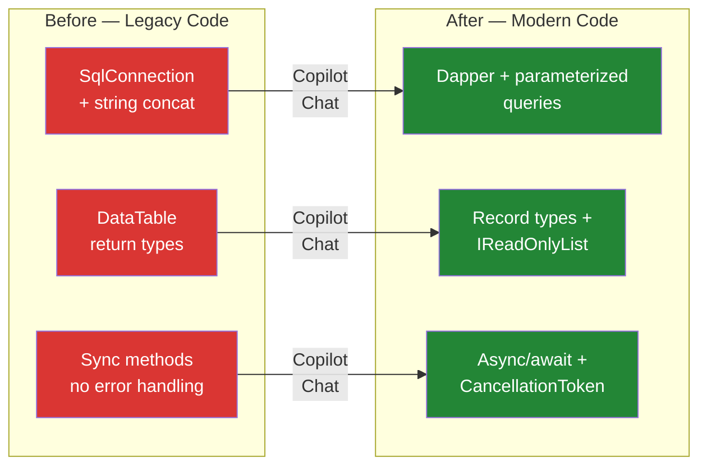
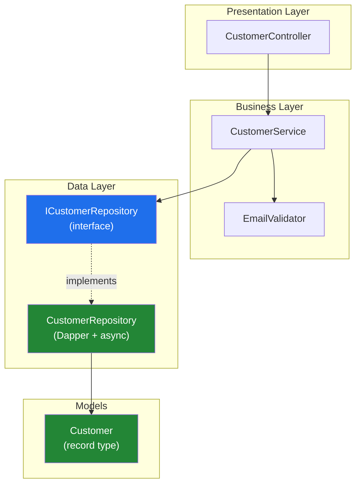
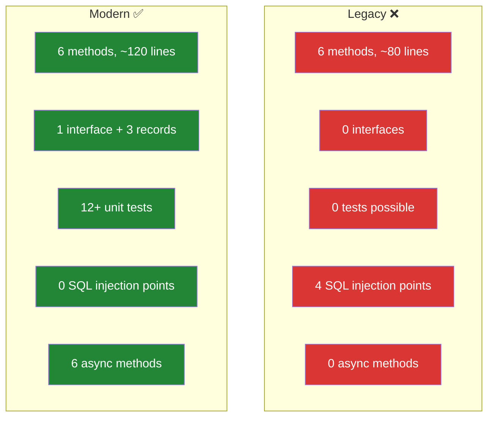

# Module 3: Modernize Legacy C# Code

> ⏱️ **Duration:** 45 minutes | 🎯 **Difficulty:** Intermediate | 👥 **Format:** Individual or Pairs

## 🎯 Goal

Use GitHub Copilot to transform `LegacyDataAccess.cs` from old-school C# into modern, safe, testable code. This exercise mirrors real-world legacy modernization that C#/.NET teams face every day.

## 📐 Modernization Journey



## 🔍 Anti-Patterns to Find

Open `LegacyDataAccess.cs` and use Copilot Chat to identify these issues:

| # | Anti-Pattern | Location | Risk | Severity |
|---|-------------|----------|------|----------|
| 1 | Hardcoded connection string | Line 14 | Can't change per environment, secrets in source | 🟡 Warning |
| 2 | SQL string concatenation | Lines 34-35, 45, 63-64, 72 | **SQL Injection vulnerability** | 🔴 Critical |
| 3 | No `using` statements | All methods | Connection leaks on exception → resource exhaustion | 🔴 Critical |
| 4 | Synchronous data access | All methods | Blocks threads, kills scalability under load | 🟡 Warning |
| 5 | Returns `DataTable` | Lines 27, 49, 79 | No type safety, no IntelliSense, brittle column access | 🟡 Warning |
| 6 | Business logic in data layer | `UpdateCustomerEmail` method | Untestable, violates Single Responsibility Principle | 🟠 Info |
| 7 | No error handling | All methods | Silent failures, data corruption, no diagnostics | 🔴 Critical |
| 8 | No cancellation support | All methods | Can't cancel long-running queries, unresponsive UI | 🟠 Info |

## 📐 Target Architecture



## 🛠️ Exercise Steps

### Step 1: Understand the Code (5 min)

Open `LegacyDataAccess.cs` in VS Code. Select all the code and ask Copilot Chat:

```
Explain this code and list every anti-pattern, security vulnerability, and 
code smell you can find. Rate each by severity (Critical, Warning, Info).
```

> 💡 **Expected:** Copilot should identify all 8 anti-patterns listed above. If it misses any, ask follow-up questions like "Are there any SQL injection risks?" or "What about resource disposal?"

### Step 2: Create Modern Types (10 min)

Ask Copilot Chat:

```
Create a Customer record type with properties: Id (int), Name (string), 
Email (string), CreatedAt (DateTime). Also create an ICustomerRepository 
interface with async methods for all CRUD operations. Use CancellationToken 
on every method. Return IReadOnlyList<Customer> for collections.
```

**Expected output should include:**

```csharp
// Models/Customer.cs
namespace ModernApp.Models;

public record Customer(int Id, string Name, string Email, DateTime CreatedAt);

public record CreateCustomerRequest(string Name, string Email);
public record UpdateEmailRequest(string Email);
```

```csharp
// Repositories/ICustomerRepository.cs
namespace ModernApp.Repositories;

public interface ICustomerRepository
{
    Task<IReadOnlyList<Customer>> GetAllAsync(CancellationToken ct = default);
    Task<Customer?> GetByIdAsync(int id, CancellationToken ct = default);
    Task<Customer> CreateAsync(CreateCustomerRequest request, CancellationToken ct = default);
    Task<bool> UpdateEmailAsync(int id, UpdateEmailRequest request, CancellationToken ct = default);
    Task<bool> DeleteAsync(int id, CancellationToken ct = default);
    Task<IReadOnlyList<Customer>> SearchAsync(string term, CancellationToken ct = default);
}
```

> ✅ **Check:** Does Copilot use `record` types? `CancellationToken`? `IReadOnlyList<T>`?

### Step 3: Implement Modern Repository (15 min)

Ask Copilot Chat:

```
Implement CustomerRepository that implements ICustomerRepository using:
- Dapper for data access (not raw SqlCommand)
- Async/await on all methods
- CancellationToken passed to all database calls
- Parameterized queries (never string concatenation)
- IDbConnection injected via constructor (for DI and testability)
- Proper using/await using for resource disposal
- ArgumentNullException.ThrowIfNull() for null guards
- Logging via ILogger<CustomerRepository>
```

**Verify the output against this checklist:**

| Check | What to Look For |
|-------|-----------------|
| ✅ No string concatenation in SQL | All queries use `@paramName` syntax |
| ✅ Async all the way | Every method returns `Task<T>` and uses `await` |
| ✅ CancellationToken | Every method accepts and passes it through |
| ✅ Dependency Injection | `IDbConnection` and `ILogger` injected via constructor |
| ✅ Resource disposal | `using` or `await using` on disposable objects |
| ✅ Null guards | `ArgumentNullException.ThrowIfNull()` on inputs |

### Step 4: Write Tests (10 min)

Ask Copilot Chat:

```
Write xUnit tests for CustomerRepository. Use:
- Moq for mocking IDbConnection
- Arrange-Act-Assert pattern
- Test both success and failure scenarios
- Test that SQL injection is impossible (parameterized queries)
- Descriptive test names like Should_ReturnCustomer_WhenValidId
```

### Step 5: Compare Before & After (5 min)

Open both files side by side (`Ctrl+\` to split the editor) and compare:



## 🎓 What You Learned

| Concept | Legacy → Modern |
|---------|----------------|
| **SQL Safety** | String concatenation → Parameterized queries |
| **Async Programming** | Blocking calls → async/await + CancellationToken |
| **Type Safety** | DataTable → Record types |
| **Testability** | Direct `new SqlConnection()` → Interface + DI |
| **Resource Management** | Manual `.Close()` → `using`/`await using` |
| **Separation of Concerns** | Mixed logic → Repository pattern + services |

## ✅ Success Criteria

- [ ] No SQL injection vulnerabilities
- [ ] All methods are async with CancellationToken
- [ ] Uses dependency injection (IDbConnection)
- [ ] Strongly-typed models (no DataTable)
- [ ] Proper error handling and resource disposal
- [ ] Unit tests with mocked dependencies

## 🏆 Bonus Challenges

1. Ask Copilot to add **retry logic with Polly** for transient database failures
2. Ask for a **caching layer** using `IMemoryCache` that wraps the repository
3. Ask Copilot to generate a **migration script** to create the Customers table
