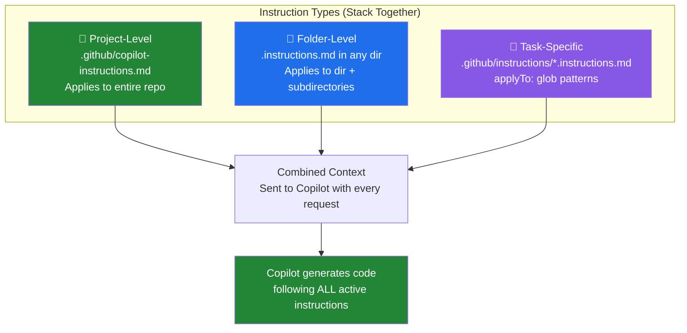
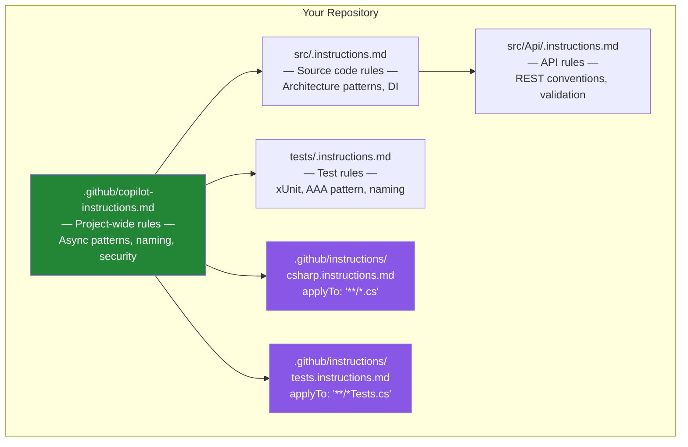
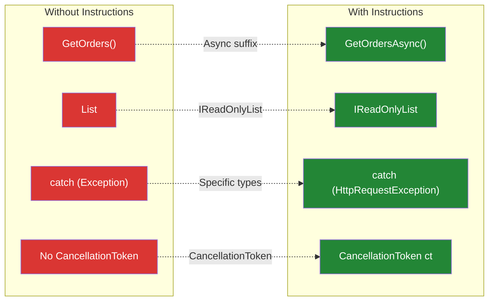

# Module 4: Custom Instructions

> ⏱️ **Duration:** 45 minutes | 🎯 **Difficulty:** Beginner–Intermediate | 👥 **Format:** Individual

## 🎯 Goal

Create instruction files that teach Copilot your team's C# coding standards. See the measurable difference in Copilot's output when instructions are present vs. absent.

## 📐 How Instructions Work



### Instruction Hierarchy



> 💡 **Key insight:** More specific instructions override general ones. Instructions **stack** — Copilot sees all applicable instructions for the current file.

## 📋 Exercise 1: Create Project-Level Instructions (15 min)

### Step 1: Create the File

Create `.github/copilot-instructions.md` in your project root:

```bash
mkdir -p .github
```

### Step 2: Add Your Team's Standards

Use the template in `copilot-instructions.md` (provided in this folder), or write your own. Here's the recommended template for C#/.NET teams:

```markdown
# C# Coding Standards

## Async Programming
- All async methods MUST end with the `Async` suffix
- Always accept `CancellationToken` as the last parameter
- Use `ConfigureAwait(false)` in library code
- Never use `async void` except for event handlers

## Error Handling
- Use `ArgumentNullException.ThrowIfNull()` for null checks
- Never catch base `Exception` — use specific exception types
- Always include context in exception messages
- No silent catches — log and rethrow or let bubble

## Types & Patterns
- Use `record` types for DTOs and value objects
- Prefer `IReadOnlyList<T>` over `List<T>` in return types
- Use file-scoped namespaces
- Use primary constructors where appropriate (C# 12+)

## Naming
- Interfaces: prefix with `I` (e.g., `ICustomerRepository`)
- Private fields: prefix with `_` (e.g., `_logger`)
- Constants: PascalCase (e.g., `MaxRetryCount`)
- Async methods: suffix with `Async`

## Security
- Never concatenate strings for SQL queries — use parameterized queries
- Validate all input at the API boundary
- Use `[Authorize]` on all controllers by default
```

## 📋 Exercise 2: Test With vs. Without Instructions (15 min)

This is the key learning moment — seeing the **measurable difference**.

### Step 1: Generate Code WITHOUT Instructions

1. **Temporarily rename** your instructions file: `copilot-instructions.md` → `copilot-instructions.md.bak`
2. Open a new C# file and ask Copilot Chat:

```
Create a service class called OrderService that:
- Fetches orders from a database
- Calculates total revenue
- Sends email notifications for high-value orders
- Has proper error handling and logging
```

3. **Save the output** — paste it into a file called `OrderService_without.cs`

### Step 2: Generate Code WITH Instructions

1. **Rename back**: `copilot-instructions.md.bak` → `copilot-instructions.md`
2. Ask the **exact same prompt** again
3. **Save the output** as `OrderService_with.cs`

### Step 3: Compare Side by Side

Open both files and look for these differences:



## 📋 Exercise 3: Create Task-Specific Instructions (10 min)

Create a file at `.github/instructions/api-controllers.instructions.md`:

```markdown
---
applyTo: "**/Controllers/**/*.cs"
---

# API Controller Standards

- All controllers inherit from `ControllerBase` (not `Controller`)
- Use `[ApiController]` and `[Route("api/[controller]")]` attributes
- Return `ActionResult<T>` from all endpoints
- Use `[ProducesResponseType]` to document all response codes
- Include `[Authorize]` unless explicitly public with `[AllowAnonymous]`
- Use `CreatedAtAction()` for POST responses (return 201, not 200)
- Accept `CancellationToken` in all async action methods
- Log entry/exit of each action using `ILogger`
```

Test it by asking Copilot to generate a new controller — it should follow all these rules automatically.

## 🎓 What You Learned

| Concept | Key Takeaway |
|---------|-------------|
| **Project-level instructions** | One file applies to every Copilot interaction in the repo |
| **Folder-level instructions** | Override project-level for specific directories |
| **Task-specific instructions** | Use `applyTo` glob patterns for file-type targeting |
| **Measurable impact** | Without instructions, Copilot guesses your conventions; with them, it follows them consistently |
| **Team scaling** | Instructions are committed to git — every team member benefits |

## ✅ Success Criteria

- [ ] Instructions file is created at `.github/copilot-instructions.md`
- [ ] Copilot follows the rules when generating new code
- [ ] You can demonstrate the difference with/without instructions
- [ ] At least one task-specific instruction file is created

## 🏆 Bonus Challenges

1. Create folder-level `.instructions.md` files for `src/` and `tests/` with different rules
2. Create instructions for a specific framework (e.g., Blazor, MAUI, Azure Functions)
3. Browse the [awesome-copilot instructions](https://github.com/github/awesome-copilot/tree/main/instructions) and install one relevant to your stack
