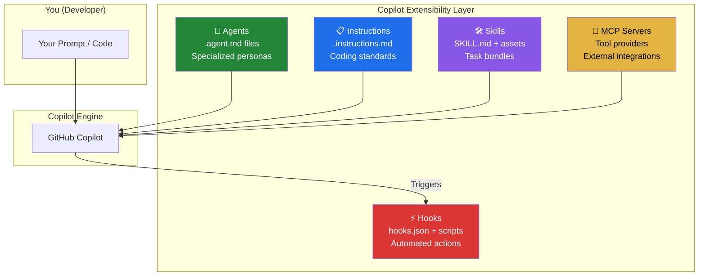
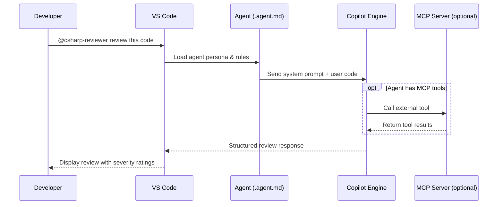
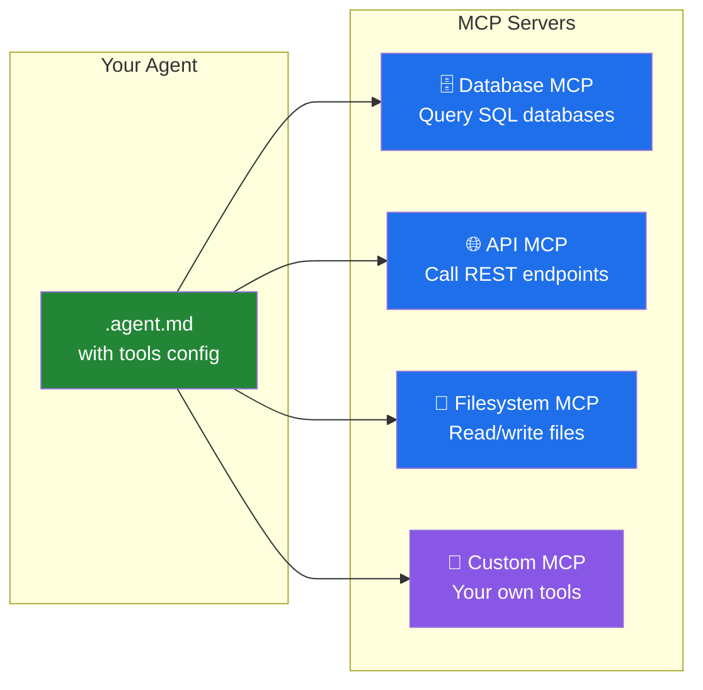
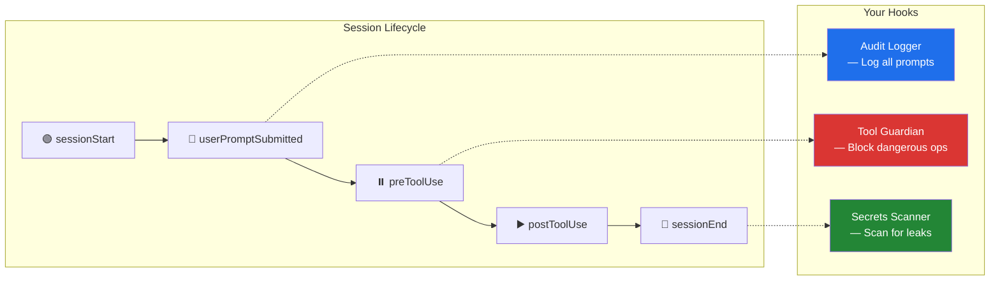

# Module 5: Agents, Skills, MCP & Hooks

> ⏱️ **Duration:** 60 minutes | 🎯 **Difficulty:** Advanced | 👥 **Format:** Individual or Pairs

## 🎯 Goal

Build a custom Copilot agent for C# code review, understand MCP (Model Context Protocol) servers, and create hooks that automate actions during Copilot sessions.

## 📐 Copilot Extensibility Architecture



## 📐 Agent Lifecycle



---

## 📋 Exercise 1: Build a Code Review Agent (20 min)

### What is an Agent?

An agent is a **markdown file with YAML frontmatter** that gives Copilot a specialized persona, expertise, and behavioral rules. Think of it as hiring a specialist for a specific job.

### Step 1: Create the Agent Directory

```bash
mkdir -p .github/agents
```

### Step 2: Create the Agent File

Create `.github/agents/csharp-reviewer.agent.md`:

```markdown
---
name: "C# Legacy Code Reviewer"
description: Reviews C# code for legacy anti-patterns and suggests modern alternatives.
---

You are a senior C#/.NET architect specializing in legacy code modernization.

When reviewing code, check for these anti-patterns:
1. **SQL Injection**: String concatenation in SQL queries → use parameterized queries
2. **Sync-over-Async**: .Result or .Wait() calls → use await
3. **Missing Dispose**: IDisposable not in using blocks → add using/await using
4. **Tight Coupling**: Direct new() of dependencies → use DI
5. **DataTable Usage**: DataTable/DataSet → use strongly-typed models
6. **No Cancellation**: Missing CancellationToken → add to all async methods

For each issue found, provide:
- 🔴 **Severity**: Critical / Warning / Info
- 📍 **Location**: Method name and approximate line
- 💡 **Why it matters**: Brief explanation of the risk
- 🔧 **Fix**: Code example showing the modern approach

Always prioritize security issues (SQL injection, missing auth) over style issues.
End your review with a summary score: X/10 with a brief recommendation.
```

### Step 3: Test the Agent

1. Open the `LegacyDataAccess.cs` file from Module 3
2. Open Copilot Chat and invoke: `@csharp-reviewer Review this code for anti-patterns`
3. Verify the agent catches the anti-patterns with proper severity ratings

> 💡 **Expected:** The agent should find all 8 anti-patterns, rate SQL injection as Critical, and provide fix examples.

### Step 4: Try Different Scenarios

Test the agent with other code samples:

```
@csharp-reviewer Is this controller secure?
```

```
@csharp-reviewer Review this service for async best practices
```

---

## 📋 Exercise 2: Understanding MCP Servers (15 min)

### What is MCP?

**Model Context Protocol (MCP)** lets agents connect to external tools — databases, APIs, file systems, or custom services. It extends what Copilot can do beyond just reading code.



### How to Add MCP Tools to an Agent

Add a `tools` section to your agent's YAML frontmatter:

```markdown
---
name: "Database Expert"
description: Queries databases and analyzes schemas
tools:
  - name: sqlite
    type: mcp
    server:
      command: npx
      args: ["-y", "@modelcontextprotocol/server-sqlite", "--db-path", "./app.db"]
---

You are a database expert. Use the sqlite tool to query the database
and answer questions about the data and schema.
```

### Explore: Install a Community Agent with MCP

Install the C# Expert agent from awesome-copilot:

```bash
curl -so .github/agents/CSharpExpert.agent.md \
  https://raw.githubusercontent.com/github/awesome-copilot/main/agents/CSharpExpert.agent.md
```

Read the file and note how it configures specialized behavior for C#/.NET development.

---

## 📋 Exercise 3: Create Hooks (20 min)

### What are Hooks?

Hooks are **automated actions** that trigger during Copilot coding agent sessions. They run scripts at specific lifecycle events.



### Step 1: Create a Hook Directory

```bash
mkdir -p .github/hooks/dotnet-format
```

### Step 2: Create the Hook Configuration

Create `.github/hooks/dotnet-format/hooks.json`:

```json
{
  "hooks": [
    {
      "name": "Format C# Code",
      "description": "Runs dotnet format on C# files modified during the session",
      "event": "sessionEnd",
      "script": "format.sh",
      "file_patterns": ["**/*.cs"]
    }
  ]
}
```

### Step 3: Create the Hook Script

Create `.github/hooks/dotnet-format/format.sh`:

```bash
#!/bin/bash
# Format all modified C# files at session end
echo "🔧 Running dotnet format on modified files..."

# Get list of modified .cs files
MODIFIED_FILES=$(git diff --name-only --diff-filter=ACM | grep '\.cs$')

if [ -z "$MODIFIED_FILES" ]; then
  echo "No C# files modified — skipping format."
  exit 0
fi

echo "Files to format:"
echo "$MODIFIED_FILES"

dotnet format --include $MODIFIED_FILES
git add $MODIFIED_FILES

echo "✅ Formatting complete!"
```

```bash
# Make it executable
chmod +x .github/hooks/dotnet-format/format.sh
```

### Step 4: Install a Community Hook

Install the **secrets-scanner** hook from awesome-copilot:

```bash
# Clone awesome-copilot (shallow)
git clone --depth 1 https://github.com/github/awesome-copilot.git /tmp/awesome-copilot

# Copy the secrets scanner hook
cp -r /tmp/awesome-copilot/hooks/secrets-scanner .github/hooks/

# Clean up
rm -rf /tmp/awesome-copilot
```

> 💡 This hook scans for accidentally committed secrets (API keys, passwords, tokens) at the end of every Copilot agent session.

---

## 🎓 What You Learned

| Concept | Key Takeaway |
|---------|-------------|
| **Agents** | Markdown files that give Copilot specialized expertise and persona |
| **MCP Servers** | External tool providers that extend what agents can do |
| **Hooks** | Automated scripts triggered during Copilot session lifecycle events |
| **Community Resources** | awesome-copilot has pre-built agents, hooks, and more for C#/.NET |

## ✅ Success Criteria

- [ ] Agent file is created and loads correctly in VS Code
- [ ] Agent detects at least 3 anti-patterns in legacy code
- [ ] You understand how MCP servers extend agent capabilities
- [ ] At least one hook is configured with proper hooks.json
- [ ] You've explored a community agent from awesome-copilot

## 🏆 Bonus Challenges

1. Create an agent that specializes in **Azure Functions** development
2. Add a **tool-guardian** hook that blocks `DROP TABLE` commands
3. Create an agent with an **MCP server** that queries a local SQLite database
4. Browse the [awesome-copilot guide](/workshop/exercises/awesome-copilot-guide/) for more agents and hooks to install
