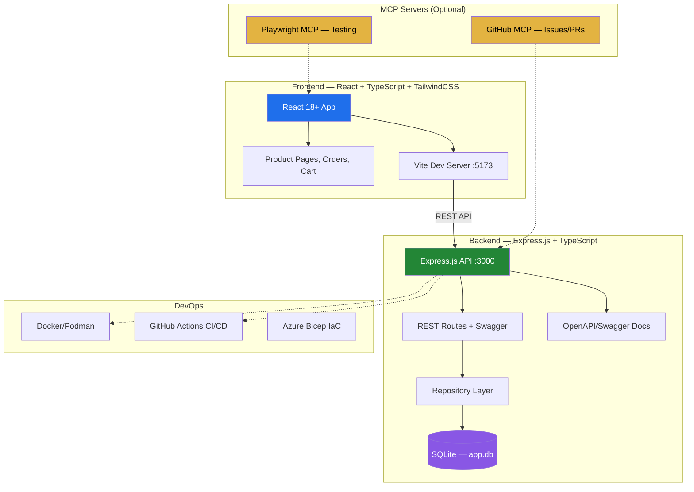
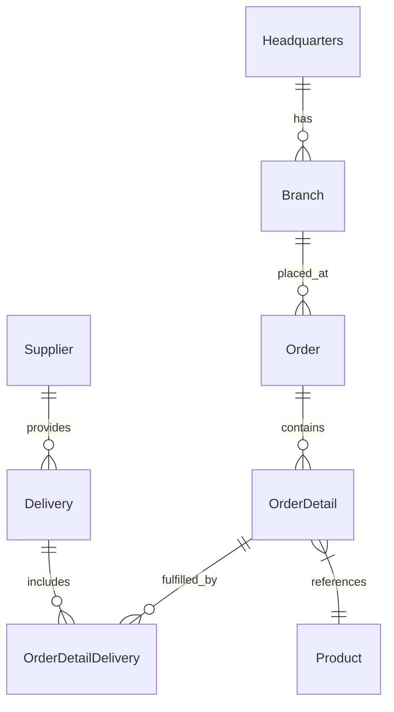
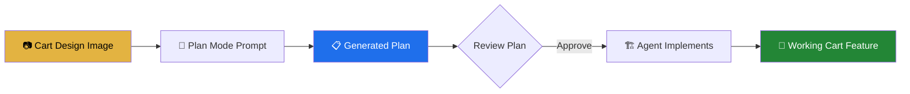
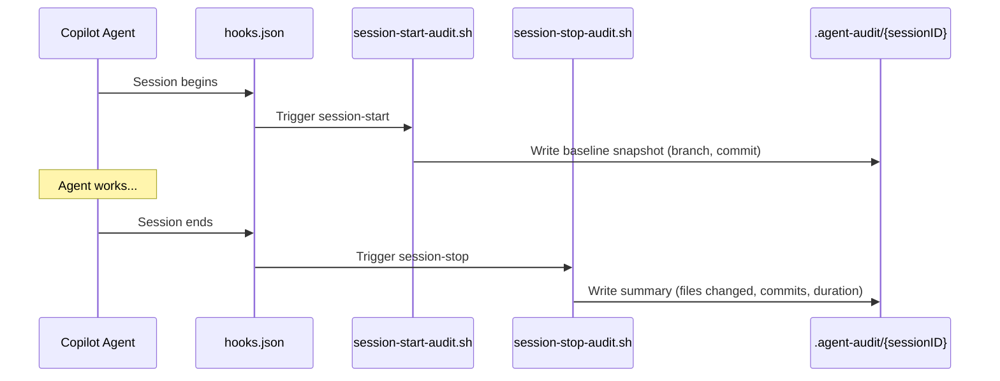

# Module 7: OctoCAT Supply — Zero to Agents Hands-on Lab

> ⏱️ **Duration:** 90+ minutes | 🎯 **Difficulty:** Intermediate–Advanced | 👥 **Format:** Individual or Pairs

## 🎯 Purpose

The **OctoCAT Supply** demo showcases the **full spectrum of GitHub Copilot's enterprise capabilities** through a real-world supply chain management application. Unlike the earlier modules that focus on individual features, this lab demonstrates how all Copilot capabilities work together in a production-style TypeScript project:

- **Agent Mode** — Multi-file feature implementation through natural language
- **Plan Mode** — Architecture planning with Copilot Vision (image-to-code)
- **MCP Servers** — Extended capabilities via Playwright and GitHub API
- **Custom Agents & Hooks** — Repository-specific AI assistants with session auditing
- **Agent Skills** — Encoded patterns for consistent code generation
- **Cloud & Background Agents** — Async task delegation and parallel experimentation
- **GHAS Integration** — Security scanning with AI-powered auto-remediation

## 📐 Application Architecture



## 📐 Data Model



---

## 📋 Prerequisites & Setup

### Required Tools

| Tool | Version | Windows Install | Mac Install | Verify |
|------|---------|----------------|-------------|--------|
| **Node.js** | 18+ | `winget install OpenJS.NodeJS.LTS` | `brew install node@18` | `node --version` |
| **npm** | 9+ | Included with Node.js | Included with Node.js | `npm --version` |
| **Git** | 2.30+ | `winget install Git.Git` | `brew install git` | `git --version` |
| **VS Code** | Latest | `winget install Microsoft.VisualStudioCode` | `brew install --cask visual-studio-code` | `code --version` |
| **Docker** (optional) | Latest | `winget install Docker.DockerDesktop` | `brew install --cask docker` | `docker --version` |

### ⚠️ Important: Windows Users — Do NOT Use `make`

The Makefile uses **Unix bash syntax** (`if [ -d ... ]`, `trap`, `&`, `wait`) which is **not compatible with Windows cmd.exe or PowerShell**. You will get `-d was unexpected at this time` errors.

**Windows users: use the npm/PowerShell commands shown below instead of `make`.**

### VS Code Extensions Required

```bash
# GitHub Copilot (required)
code --install-extension GitHub.copilot
code --install-extension GitHub.copilot-chat

# Recommended for this lab
code --install-extension ms-vscode.vscode-typescript-next
code --install-extension bradlc.vscode-tailwindcss
code --install-extension dbaeumer.vscode-eslint
```

### GitHub Personal Access Token (for MCP demos)

If you plan to do the MCP Server exercises, create a PAT:

1. Go to https://github.com/settings/tokens → **Generate new token (classic)**
2. Select scopes: `repo`, `read:org`, `read:user`
3. Save the token — you'll need it for the GitHub MCP server

---

## 🚀 Getting Started

### Step 1: Fork & Clone the Repository

**Fork the repo** (do this first in your browser):
1. Go to **https://github.com/udayansarma/octocat-supply**
2. Click the **"Fork"** button (top right)
3. Select your personal account as the destination
4. Wait for the fork to complete

**Then clone YOUR fork:**

```bash
# Replace <your-username> with your GitHub username
git clone https://github.com/<your-username>/octocat-supply.git
cd octocat-supply
```

> 💡 **Forking is recommended** so you can push changes, create PRs, and use Copilot Coding Agent features. The repo is **public** — anyone can fork it.

### Step 2: Install Dependencies

#### Mac / Linux
```bash
make install
```

#### Windows (PowerShell)
```powershell
cd api
npm install
cd ..

cd frontend
npm install
cd ..
```

### Step 3: Initialize the Database

#### Mac / Linux
```bash
make db-init
```

#### Windows (PowerShell)
```powershell
cd api
npm run db:migrate
npm run db:seed
cd ..
```

### Step 4: Start the Development Servers

#### Mac / Linux
```bash
make dev
```

#### Windows — Open TWO terminals:

**Terminal 1 — API server:**
```powershell
cd api
npm run dev
# ✅ API runs at http://localhost:3000
```

**Terminal 2 — Frontend:**
```powershell
cd frontend
$env:VITE_API_URL = "http://localhost:3000"
npm run dev
# ✅ Frontend runs at http://localhost:5173
```

### Step 5: Verify Everything Works

- **Frontend:** Open http://localhost:5173 — you should see the OctoCAT Supply homepage
- **API Docs:** Open http://localhost:3000/api-docs — you should see Swagger UI
- **API Test:** `curl http://localhost:3000/api/products` — should return JSON products

---

## 📋 Exercise 1: Copilot Foundations (20 min)

### 1A: Codebase Analysis

Open VS Code Chat in **Ask Mode** and prompt:

```
Review my codebase and explain the project including any relevant 
programming languages and test cases that are used.
```

> 💡 Observe how Copilot understands the full project structure, identifies TypeScript as the language, and lists the testing setup.

### 1B: Inline Code Completion

1. Open these files and keep them open as context:
   - `api/src/models/order.ts`
   - `api/src/repositories/ordersRepo.ts`
   - `api/src/routes/order.ts`

2. In `ordersRepo.ts`, add this comment between existing methods:

```typescript
// Count orders by branch
```

3. Switch to **Agent Mode** and prompt:

```
Add a retrieval endpoint for countByBranch that I just added. 
Also, update the API documentation for it. Do not deploy or test yet.
```

4. **Verify:** Run the app and open http://localhost:3000/api-docs → Look for `GET /api/orders/branch/{branchId}/count`

---

## 📋 Exercise 2: Agent Mode — Deep Analysis & Code Review (20 min)

### 2A: Generate Custom Instructions

In **Agent Mode**, prompt:

```
Do a super deep analysis of this codebase. Please update 
.github/copilot-instructions.md file to include best practices for 
all programming languages used in the project.
```

> 💡 Watch how the agent analyzes the entire codebase, identifies patterns, and writes comprehensive instructions.

### 2B: Code Review Against Standards

After the instructions file is generated, prompt:

```
Can you review my code and ensure it follows the best practices 
outlined in the updated copilot-instructions file
```

### 2C: Prompt Files — Model Selection

Prompt (Agent Mode):

```
/model-selection I want to add a simple cart icon and cart page to my 
frontend application. Please DO NOT implement it yet.
```

> 💡 This creates a `.prompt.md` file with a structured specification — a reusable automation template.

---

## 📋 Exercise 3: Plan Mode & Copilot Vision (25 min)

### 3A: Plan from a Design Image



1. Find the cart design: `docs/design/cart.png`
2. Attach the image to the chat and switch to **Plan Mode**:

```
Create a plan for implementing a simple cart page with a cart icon 
in the navbar. The navbar should show the number of items in the cart 
when products are added to the cart. Do not include any discount options 
for now. Keep the implementation phases simple and minimal. Skip the 
unit tests.
```

3. Review the plan — notice how Copilot uses the **image** to inform the UI design
4. Approve the plan → Hand off to Agent Mode for implementation

### 3B: GitHub Issue Integration

After the plan is approved, prompt:

```
Create an issue in my repository to track the implementation work. 
Make it a checklist.
```

Then:

```
Please implement the changes. Comment on the github issue as you 
complete each phase with an update. Do not commit the changed files 
into the repository.
```

---

## 📋 Exercise 4: Agent Skills & Custom Agents (15 min)

### 4A: Using Agent Skills

The repo includes a pre-built `api-endpoint` skill. Prompt:

```
Provide suggestions for adding an API endpoint to enhance order 
visibility and tracking
```

Then implement the suggestion:

```
Implement the order statistics endpoint
```

### 4B: Custom Agents — Accessibility Report

The repo includes a custom accessibility-report agent. Invoke it:

```
@accessibility-report Generate accessibility reports
```

---

## 📋 Exercise 5: Hooks & Session Auditing (10 min)

### How Hooks Work in This Repo



### Explore the Audit Logs

After running any agent session, check:

```bash
ls .agent-audit/
# You'll see session IDs — open any to see start/stop audit logs
```

---

## 📋 Exercise 6 (Optional): MCP Servers (15 min)

### Setup MCP Servers

1. Ensure Docker is running
2. In VS Code: `Cmd/Ctrl + Shift + P` → `MCP: List servers`
3. Start the **Playwright** server (for UI testing)
4. Start the **GitHub** server (requires your PAT)

### Use Playwright MCP for Testing

```
Use the Playwright MCP server to navigate to localhost:5173 and verify 
that the product listing page loads correctly with at least 5 products
```

### Use GitHub MCP for Issue Management

```
Use the GitHub MCP server to list all open issues in this repository 
and summarize them
```

---

## 📋 Exercise 7 (Optional): Cloud & Background Agents (10 min)

### Cloud Agent Session

Create a new cloud agent session:

```
Add a star review option to each of the products right on the product 
page. Make the star buttons flashy and easier to click. Make the color 
of the buttons RED! Test the functionality and include screenshots of 
the star review feature in the PR so that it can be reviewed easily.
```

### Background Agent Session (Security)

Create a background agent session:

```
You are a security engineer. Create a CVEFinder.prompt.md that does a 
deep inspection and looks for any CVEs in my code. After identifying 
vulnerabilities, create a GitHub issue for each one with verbose 
information for remediation.
```

---

## 🎓 What You Learned

| Concept | What It Demonstrates |
|---------|---------------------|
| **Agent Mode** | Multi-file changes across the full stack from a single prompt |
| **Plan Mode + Vision** | Image-to-implementation with structured planning |
| **Custom Instructions** | Auto-generated standards that shape all future Copilot output |
| **Prompt Files** | Reusable automation templates for common tasks |
| **Agent Skills** | Encoded patterns for consistent, project-aware code generation |
| **Custom Agents** | Specialized AI personas with sub-agent orchestration |
| **Hooks** | Automated session auditing and governance |
| **MCP Servers** | Extended capabilities (browser testing, GitHub API) |
| **Cloud/Background Agents** | Async delegation for parallel experimentation |

## ✅ Success Criteria

- [ ] Application runs locally (frontend + API + database)
- [ ] Successfully added a new API endpoint via Agent Mode
- [ ] Generated copilot-instructions.md via deep analysis
- [ ] Created a plan from a design image (Vision)
- [ ] Used Agent Skills to generate pattern-consistent code
- [ ] Explored the session audit hooks
- [ ] (Optional) Used MCP servers for testing or issue management

## 🔗 Resources

- **Workshop Repository:** https://github.com/udayansarma/octocat-supply
- **Original Source:** https://github.com/Azure-Samples/octocat-supply
- **Zero-to-Agents Lab:** [demo/walkthroughs/general/demo-steps.md](https://github.com/udayansarma/octocat-supply/blob/main/demo/walkthroughs/general/demo-steps.md)
- **Full Walkthrough Index:** [demo/walkthroughs/README.md](https://github.com/udayansarma/octocat-supply/blob/main/demo/walkthroughs/README.md)
- **Architecture Docs:** [docs/architecture.md](https://github.com/udayansarma/octocat-supply/blob/main/docs/architecture.md)
- **OctoCAT Supply README:** [OCTOCAT-README.md](./OCTOCAT-README.md)
- **API Documentation:** http://localhost:3000/api-docs (when running locally)
